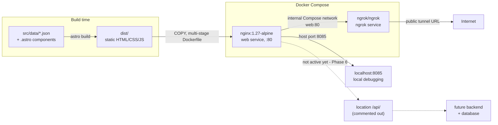

# Portfolio Website

Personal portfolio for [tanaylonkar6993](https://github.com/tanaylonkar6993), built with Astro, served by nginx in Docker, exposed publicly via ngrok.

See `decisions/` for why things are built this way, and `tasks.md` for what's done and what's left.

## Contents

- [Architecture overview](#architecture-overview)
- [Local development (no Docker)](#local-development-no-docker)
- [Docker (single container)](#docker-single-container)
- [Full stack: nginx + ngrok tunnel](#full-stack-nginx--ngrok-tunnel)
- [Editing content](#editing-content)
- [Theming](#theming)
- [Project structure](#project-structure)
- [Decision records](#decision-records)

## Architecture overview

The site is a static build with no server-side application code. At request time nginx only ever serves files from disk; the Astro build step is what turns JSON content + components into that static output.



Flow:

1. `npm run build` (or the Dockerfile's build stage) compiles `src/` into static `dist/` output — no server code, no client framework.
2. The nginx stage of the multi-stage `Dockerfile` copies only `dist/` into an `nginx:1.27-alpine` image; the runtime image never contains `node_modules` or the Astro toolchain.
3. `docker-compose.yml` runs that image as the `web` service and a separate `ngrok` service that tunnels to `web:80` over the internal Compose network (see `decisions/0003`).
4. `web` also publishes `8085:80` to the host for local debugging outside the tunnel.
5. The seam for a future backend is `nginx/nginx.conf`'s commented-out `location /api/` block — see [Future phases](#future-phases-phase-6) below. It is deliberately inert in v1 (see `decisions/0001`).

### Future phases (Phase 6)

Adding a backend + database later is designed to only require:

- uncommenting the `location /api/` block in `nginx/nginx.conf` and pointing it at a new `backend` Compose service,
- adding that `backend` service to `docker-compose.yml`,
- swapping `projects.json`'s static import for a live fetch against `/api/projects` — the JSON envelope shape (`source`, `updatedAt`, `projects`) is already designed to match what that endpoint would return, so components shouldn't need to change.

This is tracked, not built — see `tasks.md` Phase 6.

## Local development (no Docker)

```bash
npm install
npm run dev       # http://localhost:4321
```

```bash
npm run build     # outputs static site to dist/
npm run preview   # serve the production build locally
```

There is no test suite or linter configured yet.

## Docker (single container)

```bash
docker build -t portfolio .
docker run --rm -p 8085:80 portfolio
# open http://localhost:8085
```

## Full stack: nginx + ngrok tunnel

1. Copy the env template and add your ngrok authtoken (get one at https://dashboard.ngrok.com/get-started/your-authtoken):
   ```bash
   cp .env.example .env
   # edit .env and set NGROK_AUTHTOKEN=<your token>
   ```
   `.env` is gitignored and must never be committed — only `.env.example` (blank placeholder values) is checked in. See `decisions/0004`.
2. Bring up both containers:
   ```bash
   docker compose up -d
   ```
3. Site is reachable locally at http://localhost:8085 and publicly via the ngrok tunnel. Get the public URL:
   ```bash
   curl -s http://localhost:4040/api/tunnels | jq '.tunnels[0].public_url'
   ```
   (or open the ngrok inspection dashboard at http://localhost:4040)
4. Check both containers are healthy:
   ```bash
   docker compose ps
   ```
5. Tear down:
   ```bash
   docker compose down
   ```

**Known free-tier caveat:** on ngrok's free plan, the public URL changes every time the `ngrok` container restarts — there is no stable custom domain without a paid plan. Re-fetch the URL from `/api/tunnels` after any restart.

## Editing content

All editable content lives in `src/data/` as plain JSON — no code changes needed to update text, links, or the project list.

### `src/data/profile.json`

Flat object: `name`, `title`, `location`, `bio`, `githubUrl`, `linkedinUrl`, `email`, `resumeUrl`, `avatarUrl`. `email` and `resumeUrl` may be `null` if not set yet.

### `src/data/projects.json`

Wrapped in an envelope, not a bare array:

```json
{
  "source": "static-json",
  "updatedAt": "YYYY-MM-DD",
  "projects": [ /* ... */ ]
}
```

- `source` / `updatedAt` — metadata about the envelope itself. **Bump `updatedAt` whenever `projects` changes.** This envelope shape is deliberate: a future `/api/projects` endpoint (see [Future phases](#future-phases-phase-6)) is designed to return the identical shape, so swapping the data source later shouldn't require touching `ProjectsGrid.astro` or `ProjectCard.astro`.
- Each entry in `projects`:
  - `id` — stable slug, used as the list key.
  - `name`, `description`, `url`, `homepageUrl` — display text and links.
  - `language` — verify against GitHub's actual `primaryLanguage` via the API/UI rather than guessing from the description (see `decisions/0005` for a case where this mattered).
  - `topics` — array of tags; `ProjectCard.astro` renders at most the first 4.
  - `featured` — `true` puts the card in the "Featured Projects" section; `false` puts it under "More Projects" (see `ProjectsGrid.astro`).
  - `forked` — `true` renders a "Fork" badge on the card. Keep this honest: only mark repos that are actual GitHub forks (verified via `isFork`), not repos that merely extend a tutorial/template (see `decisions/0005`'s curation policy).
  - `order` — integer sort key within its `featured`/non-featured group; lower sorts first.

When adding or editing entries, keep the honest-framing policy from `decisions/0005`: describe what was actually built vs. extended, and don't badge a non-fork as a fork just because it started from a template.

## Theming

The site ships both a light and a dark palette and a visitor-facing toggle, persisted across visits — see `decisions/0006` for the full rationale. Two pieces work together:

1. **No-flash theme-init script**, inlined in `src/layouts/BaseLayout.astro`'s `<head>` (`is:inline`, runs before paint):
   - Reads `localStorage.getItem('theme')`.
   - Falls back to the visitor's OS preference via `window.matchMedia('(prefers-color-scheme: dark)')` if nothing is stored yet.
   - Sets `data-theme="dark"|"light"` on `<html>` synchronously, before the page paints, so there's no flash of the wrong theme on load.
2. **CSS custom properties**, defined in `src/styles/global.css` under `:root[data-theme="dark"]` and `:root[data-theme="light"]` (colors like `--bg`, `--fg`, `--muted`, `--accent`, `--card-bg`, `--border`). Component styles reference these variables rather than hard-coded colors, so switching `data-theme` re-themes the whole page instantly.

`ThemeToggle.astro` owns the click handler: it flips the `data-theme` attribute on `<html>` and writes the new choice to `localStorage` so it persists across reloads and future visits.

## Project structure

```
src/
├── data/            profile.json, projects.json — all editable content
├── layouts/         BaseLayout.astro
├── components/      Header, Hero, SocialLinks, ThemeToggle, ProjectCard, ProjectsGrid, Footer
├── pages/           index.astro
└── styles/          global.css (light/dark theme variables, no CSS framework)
nginx/nginx.conf     nginx config used inside the Docker image
Dockerfile           multi-stage build: node -> astro build -> nginx:alpine
docker-compose.yml   web (nginx) + ngrok services
decisions/           one file per architectural decision
tasks.md             implementation task tracker
```

## Decision records

Each file in `decisions/` captures one architectural choice: what was decided, the context, alternatives considered, and the consequences. Read these before making structural changes.

| # | Decision |
|---|----------|
| [0001](decisions/0001-static-json-project-data-source.md) | Use a hand-curated static JSON file as the project data source |
| [0002](decisions/0002-astro-frontend-stack.md) | Use Astro as the frontend framework |
| [0003](decisions/0003-two-container-ngrok-topology.md) | Two-container Docker Compose topology: nginx + ngrok |
| [0004](decisions/0004-env-file-secret-handling.md) | `NGROK_AUTHTOKEN` supplied via gitignored `.env` file |
| [0005](decisions/0005-content-curation-approach.md) | Content curated by planning assistant, reviewed/edited by user before publish |
| [0006](decisions/0006-theme-toggle-light-dark.md) | Light/dark theme toggle, vanilla JS, `localStorage`-persisted |
| [0007](decisions/0007-local-astro-version-pin-node18.md) | Pin Astro to 4.x locally due to Node 18 on the dev host |

New architectural decisions should be added as new numbered files (use `decisions/0000-template.md` as the starting point) — existing records are never edited or deleted, only superseded.
